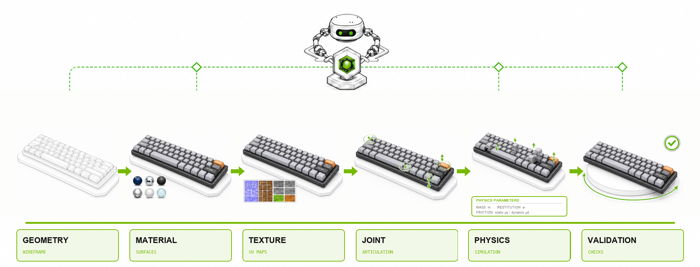
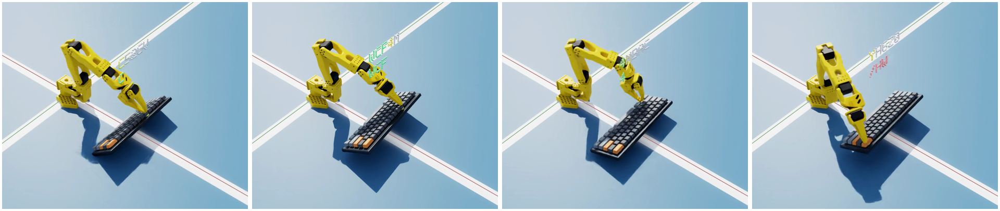

# USD Content Agents





*Generated asset in action during robot-learning polish training.*

USD Content Agents is a **reference implementation** of agentic workflows for
generating, understanding, enriching, simulating, and validating
[OpenUSD](https://openusd.org/) assets. It demonstrates how long-running coding
agents, reusable workflows, and typed Omniverse tools can produce inspectable,
testable changes with reviewable evidence. The repository is intended to be
read, forked, and adapted—not consumed as a stable SDK or deployed as-is;
interfaces, skills, and artifact contracts may change between releases.

See [Requirements](#requirements) for the minimum toolchain, recommended setup,
supported platforms and hardware, WSL2 rendering limits, and coding-agent model
policy.

The default experience is the **Agentic Content Workflow**: start at the
repository root, describe the asset outcome you want, and let a coding agent
plan and execute the appropriate workflow. Existing application CLIs, YAML
configurations, Python APIs, and REST services remain available as the
**fixed pipeline** (deterministic, non-agentic application interfaces) when that
interface is explicitly required.

## 1. Overview

### Capabilities

| Capability | Maturity | What it does | Typical outputs |
|---|---|---|---|
| **Geometry Agent** | Research Preview | Generates or revises geometry through explicitly configured external providers, prepares and repairs geometry, and separates fused meshes into semantic parts. | Source bundles, exported geometry, segmented USD, validation and OVRTX evidence |
| **Material Agent** | Beta | Analyzes rendered views, selects physically based materials, and assigns them to the correct objects. | Material decisions, authored USD, comparison renders |
| **Texture Agent** | Research Preview | Generates and applies texture maps with explicit material or prim scope and UV-readiness checks. | Texture maps, UV diagnostics, textured USD |
| **Physics Agent** | Beta | Classifies physical properties, authors USD physics, and refines simulated behavior against text or reference media. | Physics schemas, simulation results, tuning evidence |
| **Joint Agent** | Research Preview | Infers articulation candidates and authors reviewed joint topology. | Candidate graphs, review artifacts, articulated USDZ |
| **Validation Agent** | Research Preview | Evaluates USD, images, renders, video, and physics evidence against deterministic and model-assisted checks. | Structured verdicts, issues, evidence, repair guidance |

**Maturity:** Beta capabilities have broader validation but may still change;
Research Preview capabilities are exploratory and have more rapidly evolving
interfaces and support boundaries.

See the owning agent documentation for each capability's precise supported
surface and acceptance boundary.

### What This Is Not

This reference implementation is not a DCC plug-in, a real-time authoring
runtime, or a standalone text-to-3D generator. Geometry workflows orchestrate
explicitly configured external providers and retain auditable source,
validation, and render evidence.

<details>
<summary>More workflow examples</summary>


These additional SimReady examples follow individual assets from gray input
through material assignment, texture generation, and physics simulation.

</details>

### How It Works

A run separates reasoning from execution:

1. **The coding-agent runtime owns intent and reasoning.** It interprets the
   request, plans the run, evaluates evidence, and decides whether to refine.
2. **Skills and workflows own policy and run state.** They define evidence
   requirements, budgets, checkpoints, completion criteria, and recovery.
3. **Typed tools perform deterministic operations.** `usd-cli` and Omniverse
   libraries inspect, convert, optimize, author, render, simulate, restore, and
   export USD.
4. **Validation closes the loop.** Render, schema, simulation, and visual
   evidence determine whether the result is accepted or sent through another
   bounded refinement pass.

Every workflow writes a durable run directory. Depending on the task, it
contains frozen inputs, structured decisions, authored USD, renders, validation
reports, execution traces, and a final summary.

A representative run makes those artifacts explicit; exact names vary by
workflow:

```text
runs/<run-id>/
├── inputs/              # Frozen source assets and references
├── request.json         # Normalized user intent and selected workflow
├── workflow_state.json  # Phase state and safe resume information
├── decisions/           # Structured agent choices and review records
├── artifacts/           # Authored USD/USDZ and generated content
├── renders/             # Visual evidence and render metadata
├── validation/          # Checks, reports, and acceptance evidence
├── traces/              # Tool and workflow execution records
└── summary.md           # Final outcome, caveats, and artifact links
```

### Benchmarking and evaluation

The repository evaluates workflows with versioned asset cases and durable
evidence rather than relying only on a final image or a single aggregate score.
Completion and evidence-integrity checks are kept separate from
domain-specific quality measurements, so a visually plausible output cannot
hide an incomplete workflow. See [Benchmarking USD Content Agents](agentic/docs/benchmarks.md)
for the evaluation design, coverage, reproducibility rules, and limitations.

The [Astra Ultra paired development experiment](docs/experiments/astra-content-value-v2-2026-09-22/README.md)
publishes a separate ten-asset protocol comparing identical model, inputs,
tools and budgets with and without Content Agents workflows. Its scored
results are pending; the preregistration does not establish comparative value.
The [independent evaluator companion](docs/experiments/astra-content-value-v2-evaluator-2026-09-23/README.md)
provides the frozen scoring code, contracts and preparation evidence, with explicit
geometry and replay dependencies that remain outside the public bundle.
The [drawer capstone evidence](docs/experiments/astra-drawer-capstone-2026-09-21/EVIDENCE_NOTES.md)
documents a separately repaired physical task and its limits. Its
[independent evidence audit](docs/experiments/astra-drawer-capstone-chain-audit-2026-09-23/README.md)
includes a verifier for the published artifacts and identifies unavailable original receipts.

## 2. Quick Start

<a id="requirements"></a>

### Requirements

The minimum local-rendering figures below use NVIDIA's published
[Omniverse Kit baseline](https://docs.omniverse.nvidia.com/launcher/latest/common/technical-requirements.html#minimum-requirements).
The recommendation is the reference setup, not a maximum scene-size
guarantee. A remote OVRTX endpoint moves the GPU and driver requirements from
the developer workstation to the service host.

| Area | Minimum | Recommended |
|---|---|---|
| **Host** | Native Linux (x86_64 or ARM64), or WSL2 (x86_64) within the [limits below](#platform-support). | Native Linux x86_64; it supports both execution modes and local OVRTX. |
| **Toolchain** | Git, Python 3.12, and [`uv`](https://docs.astral.sh/uv/). | Use `scripts/setup_content_agent.sh` to create the managed environment. |
| **Agentic harness** | Node.js 20+, `npm`, authentication for Codex or Claude Code, and the checked-in lockfile. The lockfile pins `@openai/codex-sdk` 0.147.0 and `@anthropic-ai/claude-agent-sdk` 0.3.215. Direct-only workflows can omit the child harness and Node.js. | Use the default Codex SDK harness and verify it with `content-workflow-cli auth status`. Use Claude when its provider or authentication path is an explicit requirement. |
| **Coding-agent model and effort** | No lower model tier is qualified for this support profile. Codex: `gpt-5.6-sol` with `medium` effort. Claude Code: `claude-opus-5` with `high` effort. | Codex: `gpt-5.6-sol` with `high` effort. Claude Code: `claude-opus-5` with `high` effort. Reserve `xhigh` for the hardest quality-first work; `claude-fable-5` is an optional upgrade where available, not a requirement. |
| **Linux child sandbox** | `libseccomp`, `bubblewrap` (`bwrap`), and unprivileged user namespaces. Claude also requires `socat`. | Keep the fail-closed default sandbox and run the authentication preflight before a long workflow. |
| **Local OVRTX hardware** | Intel i7/i9 or AMD Ryzen, 16 GB system RAM, GeForce RTX 3070, and 250 GB storage are NVIDIA's published Kit baseline. The GPU must expose hardware Vulkan ray tracing. | 16+ CPU cores, 128 GB system RAM, RTX 6000 Ada 48 GB or better, and 1 TB NVMe. NVIDIA's current new-workstation recommendation is RTX PRO 6000 Blackwell. |
| **Local OVRTX driver** | Use a version in NVIDIA's current [validated Omniverse driver table](https://docs.omniverse.nvidia.com/launcher/latest/common/technical-requirements.html#driver-versions). The oldest listed Linux x86_64 workstation version is 570.169. Linux ARM64 requires 580.173.02+ or 595.84+. | Use the R595 production branch: Linux x86_64 595.58.03 or Linux ARM64 595.84+. A successful `usd-cli render-probe --require-engine ovrtx` remains the final compatibility gate. |
| **Disk** | Local OVRTX provisioning downloads about 2.5 GB in addition to the environment, workflow outputs, and optional build resources. | Keep the environment and active run directory on local NVMe storage. |

Docker is not required for the basic Agentic CLI quick start. It is required by
workflows that explicitly use a container, REST service, or Compose deployment.

### Recommended Setup

For the least constrained path, use the recommended column as one profile:
native Linux x86_64, the default Codex harness, `gpt-5.6-sol` with `high`
effort, and local OVRTX on an RTX 6000 Ada 48 GB or better with the current
R595 production driver. If the workstation has no compatible GPU, keep the
same developer setup and use a remote OVRTX endpoint.

<a id="platform-support"></a>

### Platform and Hardware Support

✅ Supported · ⚠️ Supported with limits · ❌ Unsupported

| Host | CPU architecture | Agentic Content Workflow | Fixed pipeline | Local rendering hardware |
|---|---|---|---|---|
| **Native Linux** | x86_64 or ARM64 | ✅ | ✅ | `ovrtx`: NVIDIA RTX GPU with hardware Vulkan ray tracing. `warp`: CUDA-capable NVIDIA GPU. |
| **Native Windows** | x86_64 | ❌ | ❌ | — |
| **WSL2** | x86_64 | ⚠️ [Remote OVRTX for rendering](#wsl2-rendering) | ⚠️ [`warp` only](#wsl2-rendering) | CUDA-capable NVIDIA GPU for `warp`. Local `ovrtx` is unavailable. |

The hardware column applies only to local rendering. Workflows that do not
render, or that use a remote OVRTX endpoint, do not require a local GPU; the
remote endpoint supplies the RTX/Vulkan hardware.

<a id="wsl2-rendering"></a>

#### WSL2 Rendering

- **Remote OVRTX for Agentic workflows** means the workflow runs in WSL2 but
  sends render requests to a reachable OVRTX service on a compatible native
  Linux RTX/Vulkan host. The WSL2 environment does not render locally with
  OVRTX.
- **`warp` only for fixed-pipeline workflows** means local WSL2 rendering uses
  the CUDA-based, headless Warp renderer. Warp is mesh-only and does not render
  textures, so it suits Physics and Joint inspection; it does not replace
  required OVRTX path-traced visual evidence.

Local `ovrtx` works on compatible native Linux hosts, but cannot run inside
WSL2 because WSL2 does not expose the required Vulkan driver.
If unsure which WSL2 path to choose, use remote OVRTX.

### Models and Reasoning Effort

The project supports both coding-agent harnesses with an explicit baseline and
quality-first recommendation:

| Runner | Baseline | Recommended |
|---|---|---|
| **Codex** | `gpt-5.6-sol` with `medium` effort | `gpt-5.6-sol` with `high` effort |
| **Claude Code** | `claude-opus-5` with `high` effort | `claude-opus-5` with `high` effort; use `xhigh` for the hardest work |

Use `xhigh` only for the hardest agentic work when the quality gain is worth
the additional time and tokens. `claude-fable-5` is a nice-to-have option for
long-running agents when the selected provider and account expose it; the
support profile does not require it. The
[OpenAI model guidance](https://developers.openai.com/api/docs/guides/latest-model)
describes `medium` as a balanced starting point and `high` or `xhigh` as
quality-first choices. Anthropic describes
[Claude Opus 5 as the model for complex agentic coding](https://platform.claude.com/docs/en/models/overview)
and Fable 5 as an optional higher-capability model for long-running agents. It
also documents `high` as the default Claude 5 effort, with `xhigh` for the
[hardest coding and agentic tasks](https://platform.claude.com/docs/en/build-with-claude/prompt-engineering/prompting-claude-sonnet-5#calibrating-effort-and-thinking-depth).

The CLI defaults to Codex. When `--model` or
`--model-reasoning-effort` is omitted, it inherits that value from the selected
runner's configuration; pin both flags for reproducible runs. On supported
Linux and WSL2 hosts, Claude Code is available through `--runner claude`.
Model availability depends on the selected provider and account, and the
project does not claim cross-provider quality or effort equivalence.
Fixed-pipeline VLM,
image-generation, and hosted-service models remain application-specific.

### Run the Quick Start

Clone the repository and open its root in Codex or Claude Code:

```bash
git clone -c core.longpaths=true https://github.com/NVIDIA-Omniverse/usd-content-agents.git
cd usd-content-agents
```

Native Windows execution is unsupported in the 0.6 release. On a Windows host,
run the supported workflow inside WSL2 and clone the repository inside the WSL2
Linux filesystem so its checked-in workflow skill symlinks materialize
correctly.

Both `--runner codex` and `--runner claude` reject native-Windows execution
during preflight, before provider startup. Neither runner has a supported
native-Windows sandbox configuration in 0.6, and there is no unconfined
fallback.

For native-Windows development or future qualification only, preserve the
checked-in workflow skill symlinks when cloning; otherwise most workflow skills
appear as plain text files and cannot be discovered. Run the clone from
elevated PowerShell or enable Windows Developer Mode first so Git has
permission to create symlinks:

```powershell
git clone -c core.symlinks=true -c core.longpaths=true https://github.com/NVIDIA-Omniverse/usd-content-agents.git
Set-Location usd-content-agents
```

That development-only checkout requires one of those two symlink-permission
options. If the clone ran in elevated PowerShell, close it and reopen a standard
PowerShell session, return to the clone's parent directory, and run
`Set-Location usd-content-agents` before setup.

The repository keeps tracked paths within a Windows checkout budget, but pass
`core.longpaths=true` during the initial clone to remain compatible with older
commits and forks. If checkout was interrupted with `Filename too long`, run:

```powershell
git -C .\usd-content-agents config core.longpaths true
git -C .\usd-content-agents restore --source=HEAD :/
```

The PowerShell installer supports absolute checkout, profile, temporary, and
virtual-environment paths containing spaces.

Then ask the coding agent to complete a material-assignment workflow on your
asset:

```text
Take /absolute/path/to/my_asset.usd and assign materials based on this reference
image: /absolute/path/to/reference.png.
```

Before running the manual smoke test, make OVRTX ready. On a compatible native
Linux NVIDIA RTX/Vulkan host, opt into the one-time local runtime download
(about 2.5 GB), stop any daemon started before the environment change, and run
the readiness probe:

```bash
export WU_OVRTX_AUTO_PROVISION=1
usd-cli server stop
usd-cli render-probe --require-engine ovrtx
```

The first probe starts the background install and exits nonzero; rerun that
exact probe while it reports `auto-install in progress`. Under WSL2 or on a host
without supported local OVRTX, select a remote OVRTX protocol service using the
connection details supplied by its operator:

```bash
export USD_CLI_RENDER_RENDERER=remote
export USD_CLI_RENDER_REMOTE_URL=https://gpu-host.example.com
usd-cli server stop
usd-cli render-probe --require-engine ovrtx
```

See the [`content-workflow-cli` quickstart](agentic/packages/content_workflow_cli/README.md#quickstart)
for the remote service contract and detailed readiness behavior. Operators
deploying the in-tree adapter should follow its
[deployment guide](apps/usd_cli/apps/ovrtx_rendering_api/README.md).

After setup, any required coding-agent authentication, and a successful OVRTX
probe, use the included ladder assets for a copy-pasteable first smoke test.
Budget roughly 10–30 minutes; model, renderer, and network latency can change
the runtime. The CLI defaults to the Codex runner. To reuse a `claude login`
OAuth session, add
`--runner claude --claude-execution-mode cli` immediately after
`materials assign` in either command below. With `ANTHROPIC_API_KEY` or another
Claude SDK provider credential, add `--runner claude` instead (`sdk` is the
default Claude execution mode).

On Linux or WSL2, run:

```bash
content-workflow-cli materials assign \
  --usd apps/material_agent/data/examples/ladder/sources/usd/ladder.usd \
  --reference-image apps/material_agent/data/examples/ladder/sources/images/ladder_reference_1.jpeg \
  --reference-image apps/material_agent/data/examples/ladder/sources/images/ladder_reference_2.jpeg \
  --materials-yaml apps/material_agent/data/materials/material_libs_default/materials.yaml \
  --output-dir runs/ladder-agentic
```

The coding agent discovers the checked-in setup and workflow skills, installs
what the selected workflow needs, and reports any missing runtime or credential
with the command required to resolve it. You do not need to install personal
skills for work inside the checkout.

For coding-agent context, read [`llms.txt`](llms.txt) (compact index), then
[`AGENTS.md`](AGENTS.md) (full repo-local contract), then the selected workflow
under [`.agents/skills/`](.agents/skills/). [`llms-full.txt`](llms-full.txt)
provides the expanded command and skill index.

Use `/quickstart` for first-run setup or an unqualified content task.
No skill installation is needed while the coding agent works inside this
checkout. To use materialized copies of the repository skills outside the
checkout, run:

```bash
python scripts/install_agent_skills.py
```

<a id="choose-an-execution-mode"></a>

## 3. Choose an Execution Mode

**Recommendation:** start with Agentic unless an existing
integration requires a fixed-pipeline contract. Agentic is the right default
when the workflow must inspect an unfamiliar asset, choose the next operation
from evidence, or recover and iterate. Fixed is the right choice when the
steps and interface are already known and repeatability is more important than
adaptive decision-making.

| Consideration | Agentic | Fixed pipeline |
|---|---|---|
| **Best fit** | New or unqualified content requests, visual iteration, and multi-step work whose next action depends on evidence. | Existing CLI, YAML, Python, REST, benchmark, or deployment integrations with a predetermined path. |
| **Quality and recovery** | Can inspect intermediate evidence, revise the plan, and retry locally when results are incomplete. | Runs only the validators, retries, and recovery behavior encoded in the pipeline. |
| **Cost and performance** | Model calls and iteration make token cost and latency variable. | Orchestration cost and latency are more predictable and usually lower when no adaptive decision is needed. |
| **Control** | The agent owns operation selection within the workflow contract and sandbox. | The caller owns the exact operation sequence and parameters. |

The project does not publish a controlled, apples-to-apples quality, cost, and
latency benchmark between these modes. This recommendation is based on the
required control model, not a claim that either mode is universally faster or
higher quality. If an Agentic prerequisite is missing, remediate it or choose
fixed explicitly; the workflow does not silently change modes.

| Backend | Entry point | Use it when | Next step |
|---|---|---|---|
| **Agentic** | Interactive coding agent | You want to describe an outcome and let the agent inspect evidence, choose operations, and iterate. | [Use an interactive coding agent](#interactive-coding-agent) |
| **Agentic** | Batch CLI | You want the same Agentic workflows through a repeatable command with explicit inputs and output directories. | [Use the batch CLI](#batch-cli) |
| **Fixed pipeline** | App CLI or Python API | You explicitly need an established CLI, YAML contract, Python API, or benchmark. | [Choose an app](#app-cli-and-python-api) |
| **Fixed pipeline** | REST service | You want the same fixed-pipeline capabilities through uploads, sessions, progress monitoring, or HTTP integration. | [Choose a service](#rest-services) |
| **Fixed pipeline** | Collection deployment | You want the coordinated Material, Physics, Joint, and Texture service stack. | [Deploy the collection](#collection-deployment) |

<a id="default-agentic-content-workflow"></a>

## 4. Default Agentic Content Workflow

The interactive coding agent and batch CLI use the same Agentic workflows and
produce the same durable run artifacts. Choose only how you want to initiate
and control the work.

### Interactive Coding Agent

Follow the [Quick Start](#2-quick-start), then continue describing tasks in
natural language. Start the coding agent from the repository root so it can
discover the checked-in workflow skills and project guidance. No personal
skill installation is needed.

On the first request, the coding agent can run the repository setup and ask for
any required authentication or service configuration.

### Batch CLI

Prepare the Agentic environment manually:

```bash
cp .env_example .env
./scripts/setup_content_agent.sh
source .venv/bin/activate

content-workflow-cli auth login
content-workflow-cli auth status
content-workflow-cli --help
```

On Linux/WSL2, use `--skip-build-resources` when local Scene Optimizer resources
are not needed. Use `--without-child-runners` for workflows that do not launch
Codex or Claude Code.

### Available Agentic Workflows

| Goal | Default route |
|---|---|
| Generate auditable geometry | `geometry-agent generate` with an explicitly configured Build123d, ForgeCAD, Onshape, or custom remote provider |
| Convert a supported source asset to USD | `content-workflow-cli convert-to-usd` |
| Segment a fused mesh into semantic parts | `content-workflow-cli mesh-segmentation run` |
| Assign materials with iterative visual review | `content-workflow-cli materials assign` |
| Generate and apply scoped textures | Interactive `content-workflow-texture`; focused `texture prepare` through `texture publish` operations |
| Author physics and collect behavior evidence | `content-workflow-cli physics apply` |
| Infer, review, and author articulation | `content-workflow-cli articulation run` |
| Validate content against a prompt and evidence | `content-workflow-cli validate run` |
| Validate against the SimReady profile | `content-workflow-cli simready validate-profile` |
| Process a large composed scene | `content-workflow-cli scene run` |
| Coordinate an asset through multiple stages | `content-workflow-cli asset run` |

Run `content-workflow-cli --help` and the relevant subcommand `--help` before
automating a workflow. The [Content Workflow reference](agentic/README.md)
documents exact prerequisites, arguments, recovery behavior, and artifact
contracts.

### Agentic Configuration

Copy `.env_example` to `.env` and configure the providers used by your selected
workflow:

| Provider | Environment variable |
|---|---|
| NVIDIA hosted models | `NVIDIA_API_KEY` |
| OpenAI | `OPENAI_API_KEY` |
| Anthropic | `ANTHROPIC_API_KEY` |
| Google Gemini | `GOOGLE_API_KEY` |
| NVCF-hosted functions | `NGC_API_KEY` plus the selected function IDs |
| Remote rendering | `RENDER_ENDPOINT` |
| Remote Scene Optimizer | `OPTIMIZER_ENDPOINT` |

Agent and service packages expose additional backend, model, endpoint, and
allowlist settings. Configure those only through the owning README and
`.env_example`; do not copy internal credentials or deployment defaults.

Never commit `.env` or paste credentials into prompts. The canonical skill tree
is `.agents/skills/`; `.codex/skills/` and `.claude/skills/` are compatibility
mirrors for their respective coding agents.

<a id="explicit-fixed-pipeline-opt-in"></a>

## 5. Explicit Fixed-Pipeline Backend (Opt In)

The fixed pipeline preserves the deterministic application interfaces from
earlier releases. The fixed pipeline is not an automatic fallback: a missing
Agentic prerequisite produces an error and remediation instead of silently
switching backends.

### App CLI and Python API

| Capability | Start here |
|---|---|
| Materials | [Material Agent](apps/material_agent/README.md) |
| Physics | [Physics Agent](apps/physics_agent/README.md) |
| Articulation | [Joint Agent](apps/joint_agent/README.md) |
| Textures | [Texture Agent](apps/texture_agent/README.md) |
| Validation | [Validation Agent](apps/validation_agent/README.md) |

Follow the owning README for installation, CLI commands, YAML configuration,
and Python API examples.

The Agentic setup scripts install `material-agent` directly. Installing
`content-workflow-cli` also installs the `physics-agent`,
`joint-agent`, and `texture-agent` packages and CLIs; using those fixed-pipeline
interfaces remains explicit opt-in. On Linux or WSL2, activate `.venv` and add
the Warp dependency closure for supported local WSL2 fixed-pipeline rendering:

```bash
uv pip install -e ".[warp]"
```

The general setup does not install the standalone Validation CLI. Install it
separately when that fixed-pipeline interface is required:

```bash
uv pip install -e apps/validation_agent
```

Native Windows fixed-pipeline execution remains unsupported; use WSL2 for
these commands.

### REST Services

| Capability | Start here |
|---|---|
| Materials | [Material Agent Service](apps/material_agent_service/README.md) |
| Physics | [Physics Agent Service](apps/physics_agent_service/README.md) |
| Articulation | [Joint Agent Service](apps/joint_agent_service/README.md) |
| Textures | [Texture Agent Service](apps/texture_agent_service/README.md) |

Each service README documents its installation, environment, launch command,
request contract, and client examples.

### Collection Deployment

Use the [collection deployment](deploy/collection/README.md) to run the
coordinated Material, Physics, Joint, and Texture service stack.

Invoke the root `$fixed-pipeline` skill when asking a coding agent to operate
one of these interfaces. Its nested procedures are implementation references,
not independently discoverable skills.

## 6. Development

### Project Layout

```text
.agents/skills/         Agentic workflow and routing skills
agentic/                Workflow, CAD, and validation packages
apps/                   Fixed-pipeline agents and REST services
apps/usd_cli/           Agent-first USD inspection, editing, rendering, and simulation
world_understanding/    Shared functions, typed tools, model backends, and CLI
deploy/collection/      Public multi-service deployment
assets/images/          Public README and documentation visuals
runs/                   Default location for durable user workflow results
```

### Development Setup

Create a Python 3.12 environment and install the development dependencies:

```bash
uv venv --python=3.12
source .venv/bin/activate
uv pip install -e ".[dev]"

./format.sh check
# The root suite spans independently distributed app and agentic packages.
# This command resolves a separate aggregate environment before collecting every
# configured public root testpath, preserving the active development venv.
# Public staging intentionally regenerates uv.lock after sanitization.
UV_PROJECT_ENVIRONMENT=.venv-root-tests \
  uv run --group root-tests --extra dev python scripts/run_root_tests.py
```

Use `uv` to manage dependencies. The complete development and architecture
guidance is in `AGENTS.md`.

## 7. Documentation and Policies

### Documentation

- [Content Workflow reference](agentic/README.md)
- [Migrating to USD Content Agents 0.6](MIGRATING_TO_0_6.md)
- [Material Agent](apps/material_agent/README.md)
- [Physics Agent](apps/physics_agent/README.md)
- [Joint Agent](apps/joint_agent/README.md)
- [Texture Agent](apps/texture_agent/README.md)
- [Validation Agent](apps/validation_agent/README.md)
- [Collection deployment](deploy/collection/README.md)
- [Changelog](CHANGELOG.md)

### License, Security, and Contributions

USD Content Agents is licensed under the [Apache License 2.0](LICENSE).
Third-party terms are documented in [`THIRD_PARTY_NOTICE.md`](THIRD_PARTY_NOTICE.md)
and the platform-specific [`THIRD_PARTY_NOTICE_OVPHYSX.md`](THIRD_PARTY_NOTICE_OVPHYSX.md)
and [`THIRD_PARTY_NOTICE_OVPHYSX_WINDOWS.md`](THIRD_PARTY_NOTICE_OVPHYSX_WINDOWS.md)
supplements.

Report potential vulnerabilities through the private process described in
[`SECURITY.md`](SECURITY.md), not through a public issue.

See [`CONTRIBUTING.md`](CONTRIBUTING.md) for the current contribution policy
and [`CODE_OF_CONDUCT.md`](CODE_OF_CONDUCT.md) for community expectations.
