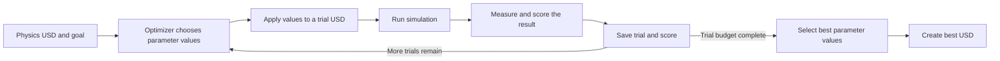
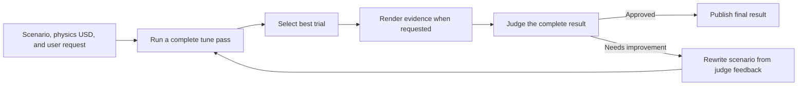

# Physics Agent Auto-Tuning

This guide covers the Physics Agent auto-tuning and refine workflows, extension
points, config-driven CLI usage, prompt-driven CLI usage, examples, and REST
integration status.

## What Tune And Refine Do

`tune` starts from a simulation-ready USD that already has physics schemas from
`apply_physics`. It patches tunable physics parameters, evaluates each candidate
in a simulation backend, records the result and score of every trial, and writes
the best parameter set.

The trial loop records every score. Adaptive optimizers use completed scores to
choose the next parameter values, while random search samples each candidate
independently. After the search finishes, an optional result judge can review
the best trial as a complete behavior.

## How Tune Chooses Parameters



The optimizer does not simulate or judge the motion itself. It proposes parameter
values and receives the score returned by each simulation trial. BoTorch and
CMA-ES use previous parameter values and scores to favor later candidates.
Random search samples uniformly and does not adapt to earlier scores.

## What Refine Adds

`refine` wraps `tune` in an outer loop. Each iteration runs a complete tune pass,
asks the result judge whether the best behavior satisfies the request, and, when
it does not, asks an LLM to rewrite the scenario YAML before starting another
complete tune pass.



## Trial Score Versus Result Judge

These are separate decisions and their values are not interchangeable:

| Decision | When it runs | What it does |
|----------|--------------|--------------|
| Trial score | Per candidate | Ranks winners and guides adaptive optimizers |
| Result judge | After a tune pass | Reviews the best complete behavior and returns `approve` or `continue` |

For `drop_settle`, the trial score comes from the selected simulation metric.
For `freeform`, it can combine trajectory measurements with a per-trial VLM
review. That per-trial VLM signal is still part of the optimizer score; it is
separate from the result judge that decides whether refinement should continue.

## Built-In Versus External Runtime

This guide covers the built-in path, where Physics Agent owns the simulation
scenario and backend. For a trusted customer-owned runtime such as an IsaacLab
repository, use the local-only `tune-external` or `refine-external` API/CLI.
That path delegates simulator setup, parameter application, and one scalar
objective to a customer adapter while Physics Agent retains qualification,
optimization, judging, and artifacts. See
[External Runtime Tuning and Local Refinement](external_runtime_tuning.md) for
the adapter protocol, trust boundary, evidence requirements, and status model.
External-runtime commands are not exposed by Physics Agent Service.

## Config-Driven CLI Usage

Install the optional tuning dependencies when using the production optimizer.
This extra covers BoTorch and tuning-side dependencies; it does not install
simulator-specific extras or the separate OvPhysX daemon environment:

```bash
uv pip install -e "apps/physics_agent[tuning]"
```

For `--engine newton` runs, install the Newton extra in the parent environment.
It includes `physics-agent[tuning]` and the PyPI
`newton[sim,importers]==1.4.0` and `newton-usd-schemas==0.4.1` dependencies.
Newton runs in-process, so no daemon venv is required:

```bash
uv pip install -e "apps/physics_agent[newton]"
```

For production `--engine ovphysx` runs, bootstrap the daemon venv as well. The
daemon uses a separate Python environment because `ovphysx` bundles an OpenUSD
version that conflicts with the parent process:

```bash
export WU_OVPHYSX_VENV_DIR="${WU_OVPHYSX_VENV_DIR:-$HOME/.cache/wu/ovphysx_venv}"
case "$(uname -m)" in
  x86_64) ovphysx_lock=apps/physics_agent/runtime/pylock.ovphysx-runtime.toml ;;
  aarch64|arm64) ovphysx_lock=apps/physics_agent/runtime/pylock.ovphysx-runtime.aarch64.toml ;;
  *) echo "Unsupported architecture: $(uname -m)" >&2; exit 1 ;;
esac
uv venv --python 3.12 "$WU_OVPHYSX_VENV_DIR"
uv pip install --python "$WU_OVPHYSX_VENV_DIR/bin/python" \
  --require-hashes --no-deps \
  -r "$ovphysx_lock" \
  --no-config --no-sources
env -u PYTHONPATH "$WU_OVPHYSX_VENV_DIR/bin/python" -c \
  "from ovphysx import PhysX; physics = PhysX(device='cpu'); physics.release()"
# Bind readiness to the exact reviewed lock and isolated interpreter before
# disabling auto-provisioning. This uses only the Python installed with
# physics-agent[tuning].
python - "$ovphysx_lock" <<'PY'
import hashlib
import json
import os
import sys
from pathlib import Path

lock = Path(sys.argv[1]).resolve()
venv = Path(os.environ["WU_OVPHYSX_VENV_DIR"]).resolve()
python = venv / ("Scripts/python.exe" if os.name == "nt" else "bin/python")
(venv / ".usd-cli-ovphysx-ready").write_text(
    json.dumps(
        {
            "python_path": str(python),
            "runtime_lock_sha256": hashlib.sha256(lock.read_bytes()).hexdigest(),
            "schema_version": "usd-cli.ovphysx-runtime-ready.v2",
        },
        indent=2,
        sort_keys=True,
    )
    + "\n",
    encoding="utf-8",
)
PY
```

Run these commands from the repository root. The checked-in PEP 751 locks
select reviewed Python 3.12/Linux x86_64, Linux aarch64, or Windows x86_64
wheels and enforce their hashes. Native Windows uses
`apps/physics_agent/runtime/pylock.ovphysx-runtime-windows.toml`, but native
Windows fixed-pipeline execution is outside the supported packaged-wheel scope.
Service Docker builds select the corresponding Linux tuning and daemon locks
from BuildKit's `TARGETARCH` value. The readiness marker is written only after
the isolated runtime imports and initializes successfully; service health and
OvPhysX request preflight both require it.

Run the normal pipeline first to produce a physics-authored USD:

```bash
physics-agent run apps/physics_agent/configs/lightbulb.yaml
```

Then tune that physics USD with a scenario YAML:

```bash
physics-agent tune apps/physics_agent/configs/tuning/drop_settle.yaml \
  --physics-usd path/to/asset_physics.usda \
  --engine ovphysx \
  --optimizer auto \
  --output-dir output/tune
```

For Newton, choose a scenario whose parameters are supported by the Newton
MuJoCo path. The tire bounce reference uses `contact_ke` and `contact_kd`
instead of USD restitution:

```bash
physics-agent tune apps/physics_agent/configs/tuning/tire_b01_drop_settle_newton.yaml \
  --physics-usd path/to/tire_physics.usda \
  --engine newton \
  --optimizer random \
  --output-dir output/tire_tune_newton
```

`--optimizer auto` resolves to BoTorch. If BoTorch is not installed, it raises an
install-hint error instead of silently falling back to random search. The
`random` and `cma-es` optimizers are always available baselines.

Use `refine` when the judge should be allowed to rewrite the scenario and run
more tune iterations:

```bash
physics-agent refine apps/physics_agent/configs/tuning/drop_settle.yaml \
  --physics-usd path/to/asset_physics.usda \
  --user-prompt "make it bouncy" \
  --output-dir output/refine \
  --engine ovphysx \
  --optimizer botorch \
  --max-trials 30 \
  --seed 42 \
  --max-iterations 3 \
  --score-threshold 0.9 \
  --no-visual-evidence
```

This text-only example disables generated visual evidence so it does not require
a USD renderer. Without `--no-visual-evidence`, refine renders the winning
recording to PNG and fails closed if the configured renderer is unavailable.

For the bundled Tire_B01 bounce example, generate the physics USD first and then
run the behavior-guided refine loop. Generated PNG evidence frames are rendered
for every winning trial:

```bash
physics-agent run apps/physics_agent/configs/tire_bounce.yaml

physics-agent refine apps/physics_agent/configs/tuning/tire_b01_drop_settle.yaml \
  --physics-usd apps/physics_agent/configs/.tire_bounce/physics/tire_physics.usdc \
  --user-prompt "Show a visible airborne first rebound, natural tipping motion, and final settling." \
  --judge-reference-frames 32 \
  --judge-generated-frames 32 \
  --output-dir /tmp/tire_bouncy_frames \
  --engine ovphysx \
  --optimizer botorch \
  --max-trials 30 \
  --max-iterations 12 \
  --score-threshold 0.9 \
  --seed 42
```

To compare against an observation, export representative moments as PNG, JPEG,
WebP, or BMP images and repeat `--reference-image` in chronological order.
Configure the judge backend and credentials for your environment before running
the example. Video files and legacy video options are rejected by public 0.6
surfaces.

The same `tune` and `refine` surfaces accept `--engine newton` when the scenario
uses Newton-supported parameters. Newton supports `mass_scale`,
`dynamic_friction`, `contact_ke`, and `contact_kd`; it rejects
`static_friction` and `restitution` before queueing the run because the current
Newton importer and MuJoCo solver path cannot apply those USD-authored knobs
effectively. Use `--engine ovphysx` for static-friction or restitution tuning.

## Prompt-Driven CLI Usage

`tune` can run without a scenario YAML when `--user-prompt` and `--physics-usd`
are supplied. The prompt interpreter authors a scenario and stores the inferred
scenario as an audit artifact.

```bash
physics-agent tune \
  --user-prompt "make this tire bounce higher after it hits the ground" \
  --physics-usd path/to/tire_physics.usda \
  --engine ovphysx \
  --optimizer auto \
  --output-dir output/tire_tune
```

You can also provide both a scenario YAML and `--user-prompt`. In that mode,
explicit YAML fields win on conflicts and the prompt interpreter fills missing
fields.

Reference images can be attached to tune or refine judge calls:

```bash
physics-agent tune apps/physics_agent/configs/tuning/drop_settle.yaml \
  --physics-usd path/to/asset_physics.usda \
  --reference-image observed_contact.png \
  --reference-image observed_rebound.png \
  --judge-max-tokens 2048 \
  --judge-temperature 0
```

## Scenario YAML

A scenario declares the scenario kind, target simulation settings, optional
judge settings, and tunable parameter bounds.

```yaml
name: drop_settle
metric: settle_distance

target:
  drop_height_m: 0.5
  duration_s: 2.0
  gravity: -9.81
  sample_fps: 30
  cameras: ["+x+y+z"]
  vlm_check: "off"
  record_frames: "off"
  frame_renderer: "ovrtx"

judge:
  temperature: 0.0
  max_tokens: 2048

parameters:
  - name: mass_scale
  - name: static_friction
  - name: dynamic_friction
  - name: restitution
```

When `min` and `max` are omitted, Physics Agent centers the initial search on
the value already authored in the input physics USD. One shared multiplier,
`1.1`, produces `[authored / 1.1, authored * 1.1]`. `mass_scale` is relative,
so its automatic range is `[1 / 1.1, 1.1]`. Explicit YAML bounds remain
unchanged and take precedence. Unauthored sibling attributes are ignored when
another matching attribute has an authored value. A zero-width multiplicative
range uses the selected backend capability's fallback range. Prompt-only Newton
`contact_ke` and `contact_kd` may also use their capability ranges when their USD
attributes are not authored. Simulator-only parameters have no USD value to
inspect and require explicit bounds. `mass_scale` requires at least one authored
mass because it scales existing values.
Auto-derived restitution bounds are clamped to its physical `[0, 1]` domain. If
independently centered static- and dynamic-friction ranges have no feasible
overlap, automatic friction ranges use their capability fallbacks; explicitly
authored YAML ranges remain unchanged. A parameter must specify both `min` and
`max`, or omit both for automatic bounds; one-sided ranges are rejected. When
both friction coefficients are present, they must both use automatic ranges or
both use explicit ranges. Mixed modes are rejected during request validation.

Prompt-generated initial scenarios always use automatic bounds, so their first
sweep is intentionally limited to roughly 10% around a nonzero authored value.
Single-shot `tune` performs only that sweep; provide explicit YAML bounds when a
larger change must be reachable immediately. During `refine`, the scenario
refiner may widen later searches with a new explicit `min`/`max` pair or omit
both to return to automatic bounds. The concrete bounds used for every
successful iteration are persisted in that iteration's `scenario.yaml`. A
failed resolution persists the unresolved scenario and terminates with an error
record in `refine_summary.json`.

For built-in Physics Agent scenarios, when both friction coefficients are
tunable, their effective ranges remain independent: a normalized optimizer
coordinate always maps to the same physical value. BoTorch receives the explicit
linear constraint
`static_friction - dynamic_friction >= 0`. Random search and BoTorch initial or
fallback candidates are sampled directly from the feasible region. CMA-ES gives
infeasible proposals a finite penalty without simulating them and fills any
unspent trial budget with direct feasible samples. Candidate decoding never
rewrites one coefficient based on the other. BoTorch candidates that miss the
boundary only by scaled solver precision are projected just inside it before
evaluation; larger violations are discarded. Disjoint friction ranges fail
during scenario parsing, while ranges that touch at one feasible pair are
supported by pinning both friction coordinates instead of constructing a
measure-zero optimizer region. External-runtime parameter names are opaque and
do not inherit this built-in friction rule.

`target.frame_renderer` selects the shared rendering contract for inspection
frames: `remote`, `ovrtx` (the default), `warp`, or `mock`. Unknown names fail
the render attempt with a configuration error. `mock` produces deterministic
CPU-only test evidence and must not be used as production visual evidence.

Reference configs:

| Config | Purpose |
|--------|---------|
| `apps/physics_agent/configs/tuning/drop_settle.yaml` | Generic drop-settle scenario and schema comments |
| `apps/physics_agent/configs/tuning/tire_b01_drop_settle.yaml` | Tire_B01 drop-settle scenario with camera ground bias and PNG frame recording |
| `apps/physics_agent/configs/tuning/tire_b01_drop_settle_newton.yaml` | Tire_B01 Newton drop-settle scenario using contact stiffness/damping for bounce tuning |
| `apps/physics_agent/configs/tuning/container_c04_slide.yaml` | Text-guided freeform slide scenario for the public Container_Gray_C04 asset |
| `apps/physics_agent/configs/tire_bounce.yaml` | Public classification/apply config used to create a physics USD for tire bounce tuning |

## Extension Points

### Add A Scenario Kind

Scenario kinds are registered in `physics_agent.tuning.types.SUPPORTED_SCENARIOS`
and advertised per engine in
`physics_agent.tuning.scenarios.SUPPORTED_SCENARIOS_PER_ENGINE`. Add a module
under `physics_agent/tuning/scenarios/` that exports an `evaluate(...)` callable,
then add it to `physics_agent.tuning.scenarios.resolve(...)`.

The runner and REST router both use the same capability map, so unsupported
engine/scenario pairs fail before an expensive background job is queued.

### Add A Metric

Metrics for `drop_settle` live in
`physics_agent.tuning.scenarios.drop_settle._METRICS`. A metric receives a
`MetricContext` and returns a scalar where lower is better. Quantities that are
physically "higher is better" should be negated before returning.

`max_bounce_height` measures the first rebound from the body's bbox bottom using
up-axis velocity transitions, then returns the negative bounce height so the
optimizer still minimizes. Contact and apex are deliberately velocity-defined
events: the metric does not use ground-distance tolerances, contact windows, or
position-decrease fallbacks to decide those events. Geometry is only used to
measure bbox-bottom height at the detected samples. Optional target knobs are
`bounce_min_downward_velocity` (default `0.05`) and
`bounce_min_upward_velocity` (default `0.02`). Velocity thresholds are meters per
second in normal tune/refine runs because `drop_settle` metric-bakes the scene
before simulation; direct `MetricContext` callers should pass trajectories in
the same metric units.

### Add A Tunable Parameter

The supported tunable parameter keys live in
`physics_agent.tuning.types.SUPPORTED_PARAM_KEYS`. Backend capability declarations
map each name to the authored USD attribute used for automatic bounds and trial
patching. Add tests before expanding this set because existing scenarios, prompt
interpretation, USD patching, and report artifacts assume these names.

### Add An Optimizer

Optimizers are dispatched through `physics_agent.tuning.optimizers`. Add the
public optimizer name to `SUPPORTED_OPTIMIZERS`, implement a runner that calls
the supplied `evaluate(params)` callback up to `max_trials`, and wire it through
`resolve_optimizer(...)` / `get_runner(...)`.

### Add A Simulation Backend

Backends implement `physics_agent.tuning.backend.TuningBackend.evaluate(...)`.
Register the engine name in `SUPPORTED_ENGINES` and return an instance from
`get_backend(...)`. Production backends should lazy-import heavy dependencies so
the base package can still import without optional tuning extras.

OvPhysX runs through an isolated daemon venv because its bundled OpenUSD can
conflict with the parent process. Newton is loaded from the parent environment
through `apps/physics_agent[newton]` and should expose its supported tunable
parameters through `physics_agent.tuning.capabilities` so CLI and REST callers
fail before an expensive simulation job is queued.

### Extend Judge Evidence

Reference images are normalized in `physics_agent.tuning.visual_evidence`.
Judge outputs are persisted under
`judge.extra.visual_evidence` in `tune_results.json`, `judge_result.json`, and
`report.md`. Refine renders the selected trial to PNG evidence even when the
request has only a text prompt, so the VLM judges the simulated motion for both
built-in scenario kinds. These judge renders do not encode or publish MP4.
Visual-evidence paths fail closed when required generated evidence or a real
judge verdict is unavailable. The winning trial must persist `recording_usd`;
`fake` refine runs must set `--no-visual-evidence`. Reference preparation and
generated rendering use `--visual-evidence-timeout-seconds`, independently of
the judge/refiner LLM timeout.

## REST Integration

The service exposes single-shot tuning through `/tune`:

| Endpoint | Purpose |
|----------|---------|
| `POST /tune` | Create a tune session from a physics USD upload, S3 URI, or completed pipeline `source_session_id` |
| `GET /tune/{session_id}/status` | Poll trial count, best score, best params, and terminal status |
| `GET /tune/{session_id}/results` | Fetch final or partial tune results plus artifact URLs |
| `GET /tune/{session_id}/events` | Stream trial progress over SSE on the executing instance |
| `POST /tune/{session_id}/cancel` | Cooperatively cancel a pending or running tune session |
| `GET /tune/{session_id}/artifacts/{name}` | Download `best_params.json`, `tune_results.json`, `history.jsonl`, `report.md`, `tuned_physics.usd`, or `comparison.png` |

The service also exposes iterative refine through `/refine`:

| Endpoint | Purpose |
|----------|---------|
| `POST /refine` | Create a refine session from a physics USD upload, S3 URI, or completed pipeline `source_session_id`; requires both `scenario_yaml` and `user_prompt` |
| `GET /refine/{session_id}/status` | Poll iteration number, per-iteration trial count, best params, judge score, and terminal reason |
| `GET /refine/{session_id}/results` | Fetch final or partial refine results plus final artifact URLs |
| `GET /refine/{session_id}/events` | Stream iteration/trial/judge progress over SSE on the executing instance |
| `POST /refine/{session_id}/cancel` | Cooperatively cancel a pending or running refine session |
| `GET /refine/{session_id}/artifacts/{name}` | Download `refine_summary.json` and final iteration artifacts under `final/` |

The REST worker delegates to `physics_agent.tuning.arun_tune` through
`apps/physics_agent_service/service/workers/tune_executor.py` and reuses the
same `SessionManager`, `JobRegistry`, `EventBus`, cancellation marker, and
artifact-store sync patterns as `/pipeline`.

The refine REST worker delegates to `physics_agent.api.arun_refine` through
`apps/physics_agent_service/service/workers/refine_executor.py`. NVCF refine
builds the judge/refiner models server-side with the deployment-configured
backend and credential.

## Service Client Status

The bundled Python service client currently focuses on `/pipeline` workflows.
For `/tune`, use raw HTTP, generated clients from `openapi.yaml`, or add a
client wrapper that mirrors the service API documented in
`apps/physics_agent_service/docs/api.md`.

## Release QA Checklist

For a release QA pass, verify at least one run from each interface:

| Surface | Minimum check |
|---------|---------------|
| Config CLI | `physics-agent tune apps/physics_agent/configs/tuning/drop_settle.yaml --physics-usd ...` |
| Prompt CLI | `physics-agent tune --user-prompt "make this object bouncy" --physics-usd ...` |
| Refine CLI | `physics-agent refine ... --user-prompt ... --max-iterations 2` |
| Material + refine | Run the blue-container flow below and verify material assignment, physical behavior, and a judge score of at least `0.90` |
| Python API | `run_tune(TuneInput(...))` and `run_refine(RefineInput(...))` construct and return typed outputs |
| REST tune | `POST /tune`, status polling, results, artifact download, and cancellation behavior |
| REST refine | `POST /refine`, status polling, results, final artifact download, cancellation behavior, and server-side model configuration |

### Container Material-To-Refine QA

This cross-agent check starts with the self-contained public
[Container_Gray_C04 asset](../data/examples/Container_Gray_C04/README.md):

```bash
material-agent run apps/material_agent/configs/container_blue.yaml --clean

physics-agent refine apps/physics_agent/configs/tuning/container_c04_slide.yaml \
  --physics-usd apps/material_agent/configs/.container_blue/output/output.usd \
  --user-prompt "Make this closed blue plastic warehouse container slide realistically across a flat dry industrial floor after a gentle horizontal push, decelerating smoothly and coming naturally to rest while its lid and body remain together." \
  --output-dir /tmp/container_blue_refine \
  --engine ovphysx --optimizer botorch \
  --max-trials 8 --max-iterations 3 --score-threshold 0.9 \
  --seed 42
```

Accept the run when both visible parts use the `Plastic Dark Blue` library
material, refine terminates with `approved` at `judge_score >= 0.90`, the lid
and body remain together, and the container slides and settles without
bouncing, reversing, falling over, or penetrating the ground. Exact optimizer
parameters and scores may vary. Inspect the final scenario and tuned parameters
for unintended refiner changes in addition to checking the aggregate score.
