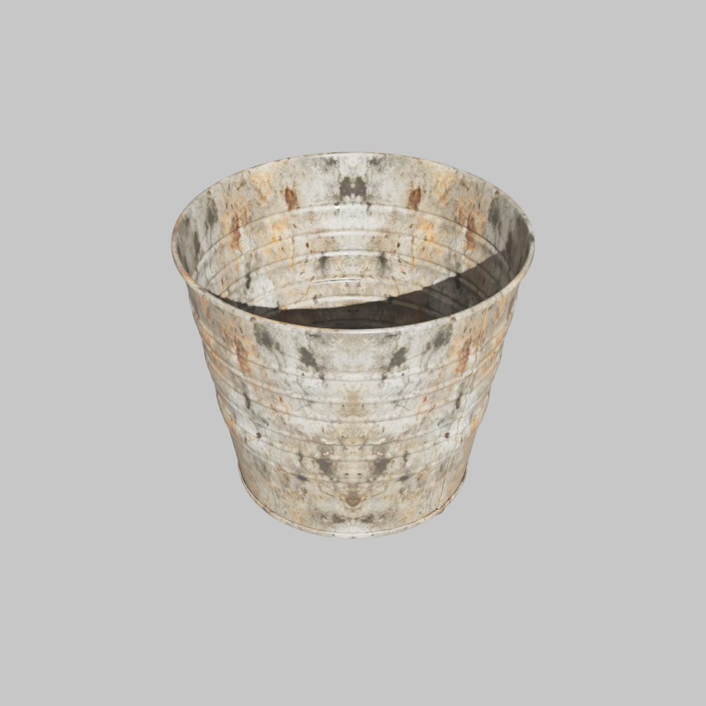
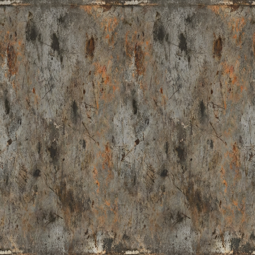
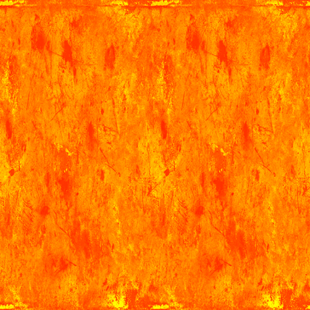

# Simple Image-Gen Bucket Example

This example runs the Texture Agent CLI on the public SimReady cleaning bucket
asset using the lightweight `simple_image_gen` backend. It is the baseline path
for comparing a direct image-generation texture pass against the UV-aware
Step1X service example.

Reference outputs:







The exact generated details vary by provider and model. The pass criteria below
focus on reproducible pipeline behavior: one scoped material target, albedo and
ORM outputs, a textured USD, and a final render.

## End-To-End Checklist

Run the example in this order:

1. Install the repo and Texture Agent environments.
2. Start OVRTX when final render evidence is required.
3. Download and package the bucket asset as USDZ.
4. Create the exact config below.
5. Run `texture-agent run`.
6. Check the manifest, output USD, texture maps, and render.
7. Create the visual evidence sheet and compare it with the Step1X reference
   comparison.

## Prerequisites

- Linux, Linux container, or WSL2 environment.
- Repo environment installed from the repository root:

```bash
source .venv/bin/activate
uv pip install -e ".[dev]"
uv pip install -e apps/texture_agent
```

- One configured image-generation provider. Use one of:
  - `GOOGLE_API_KEY` for `texture.image_gen.backend: gemini`
  - `NVIDIA_API_KEY` for `texture.image_gen.backend: nim`
  - `OPENAI_API_KEY` for `texture.image_gen.backend: openai`
- Optional OVRTX render endpoint for final render evidence:

```bash
OVRTX_RENDER_MODE=pt \
docker compose -f apps/ovrtx_rendering_api/docker-compose.yml up --build -d

export RENDER_ENDPOINT=http://localhost:8001
```

## Download the Bucket Asset

The source asset is the public SimReady cleaning bucket from the Hugging Face
SimReady Warehouse dataset.

```bash
source .venv/bin/activate
uv pip install -U huggingface_hub

hf download --repo-type dataset nvidia/PhysicalAI-SimReady-Warehouse-01 \
  --include "Props/general/HandManipulation/cleaning_bucket_a/**" \
  --local-dir .data/material_agent_demo/hf/
```

Package the downloaded USD and sidecar textures into one USDZ:

```bash
python - <<'PY'
from pathlib import Path
from pxr import UsdUtils

src = Path(
    ".data/material_agent_demo/hf/Props/general/HandManipulation/"
    "cleaning_bucket_a/sm_cleaning_bucket_iron_a01_simready_01.usd"
)
out = Path(".data/texture_agent_examples/simple_bucket/bucket.usdz")
out.parent.mkdir(parents=True, exist_ok=True)
if not src.is_file():
    raise SystemExit(f"missing source asset: {src}")
if not UsdUtils.CreateNewUsdzPackage(str(src), str(out)):
    raise SystemExit(f"failed to create {out}")
print(out.resolve())
PY
```

## Create the Config

This config edits only the bucket metal material. It intentionally uses scoped
forced projection to match the simple image-gen baseline comparison. The Step1X
example uses existing UVs for this same bucket.
The config uses Gemini by default; switch `backend` and `model` if your
environment uses NIM or OpenAI image generation.

```bash
RUN_ROOT=".data/texture_agent_examples/simple_bucket/run_$(date -u +%Y%m%d_%H%M%S)"
mkdir -p "$RUN_ROOT"

cat > "$RUN_ROOT/config.yaml" <<'YAML'
project:
  name: "simple_image_gen_bucket"
  session_id: "simple_image_gen_bucket"
  working_dir: "../work"

input:
  usd_path: "../bucket.usdz"
  prim_paths:
    - "/RootNode/Materials/opaque__metal__cleaning_bucket_a"

texture:
  backend: "simple_image_gen"
  image_gen:
    backend: "gemini"
    model: "gemini-3-pro-image-preview"
  mode: "per_material"
  uv_policy: "force_projection"
  uv_scope: "target_prims"
  uv_backend: "python"
  uv_projection: "box"
  uv_rebake_source_albedo: false
  size: 512
  workers: 1
  seed: 42
  skip_existing: false

material_textures:
  opaque__metal__cleaning_bucket_a:
    prompt: "worn metal bucket, heavy usage marks, rubbed edges, surface wear, scuffed texture"
    opacity: 1.0
    material_path: "/RootNode/Materials/opaque__metal__cleaning_bucket_a"
    prim_paths:
      - "/RootNode/Geometry/sm_cleaning_bucket_a01_01"

auto_prompt:
  enabled: false

variations:
  count: 1

steps:
  prepare_uvs:
    enabled: true
  discover_materials:
    enabled: true
  render_previews:
    enabled: false
  generate_textures:
    enabled: true
    max_workers: 1
    skip_existing: false
  blend_textures:
    enabled: true
    default_opacity: 1.0
    output_size: 512
  apply_textures:
    enabled: true
  render:
    enabled: true
    backend: "remote"
    image_width: 1024
    image_height: 1024
    camera_direction: "+x+y+z"
    camera_margin: 1.20
    focus_cameras: true
    focus_prim_paths:
      - "/RootNode/Geometry/sm_cleaning_bucket_a01_01"
    max_focus_cameras: 1
    focus_camera_direction: "+x+y+z"
    focus_camera_margin: 1.15
    target_frame_coverage_threshold: 0.2
YAML
```

The Texture Agent USD rendering fields support `remote`, `ovrtx`, and `mock`.
This example uses `remote` so its final image comes from the configured OVRTX
render service. `mock` is useful for CPU-only pipeline smoke tests, but its
deterministic placeholder images are not production visual evidence and do not
satisfy the render pass criteria below.

## Run

```bash
source .venv/bin/activate
texture-agent run "$RUN_ROOT/config.yaml"
```

If you do not need final render evidence, set `steps.render.enabled: false` or
run with `--skip render`.

## Pass Criteria

Check the manifest and files:

```bash
MANIFEST=".data/texture_agent_examples/simple_bucket/work/artifacts_manifest.json"
jq '{
  schema_version,
  generated_textures: (.generated_textures | length),
  output_usd: .outputs.textured_usd,
  renders: .renders
}' "$MANIFEST"

test -f .data/texture_agent_examples/simple_bucket/work/textures/opaque__metal__cleaning_bucket_a_albedo.png
test -f .data/texture_agent_examples/simple_bucket/work/textures/opaque__metal__cleaning_bucket_a_orm.png
test -f .data/texture_agent_examples/simple_bucket/work/output/textured_output.usd
```

## Create Visual Evidence

Create a local comparison sheet from the run artifacts. If Pillow is missing,
run `uv pip install pillow` in the active environment.

```bash
python - <<'PY'
from pathlib import Path

from PIL import Image, ImageDraw

work_root = Path(".data/texture_agent_examples/simple_bucket/work")
example_dir = Path("apps/texture_agent/examples/simple_image_gen_bucket")
material = "opaque__metal__cleaning_bucket_a"
rows = [
    (
        "final render",
        example_dir / "reference_render.png",
        work_root / "renders/render_0_0_0.png",
    ),
    (
        "albedo",
        example_dir / "reference_albedo.png",
        work_root / f"textures/{material}_albedo.png",
    ),
    (
        "ORM",
        example_dir / "reference_orm.png",
        work_root / f"textures/{material}_orm.png",
    ),
]

missing = [str(path) for _, *paths in rows for path in paths if not path.is_file()]
if missing:
    raise SystemExit("missing evidence files:\n" + "\n".join(missing))

cell_w, cell_h, label_h = 420, 300, 34
sheet = Image.new("RGB", (cell_w * 2, label_h + len(rows) * (cell_h + label_h)), "white")
draw = ImageDraw.Draw(sheet)
draw.text((12, 8), "reference", fill="black")
draw.text((cell_w + 12, 8), "current simple image-gen run", fill="black")

for index, (label, ref_path, got_path) in enumerate(rows):
    y = label_h + index * (cell_h + label_h)
    draw.text((12, y + 8), label, fill="black")
    for column, path in enumerate((ref_path, got_path)):
        image = Image.open(path).convert("RGB")
        image.thumbnail((cell_w - 24, cell_h - 24))
        x = column * cell_w + (cell_w - image.width) // 2
        sheet.paste(image, (x, y + label_h + (cell_h - image.height) // 2))

out = work_root / "visual_evidence_simple.png"
sheet.save(out)
print(out)
PY
```

Expected output:

```text
.data/texture_agent_examples/simple_bucket/work/visual_evidence_simple.png
```

Expected:

- one texture set generated for `opaque__metal__cleaning_bucket_a`
- `*_albedo.png` exists and shows visible generated wear or grime
- `*_orm.png` exists
- `output/textured_output.usd` opens with USD tooling
- when rendering is enabled, `work/renders/render_0_0_0.png` exists and shows
  the textured bucket
- `work/visual_evidence_simple.png` shows the current render, albedo, and ORM
  next to the checked-in references.
