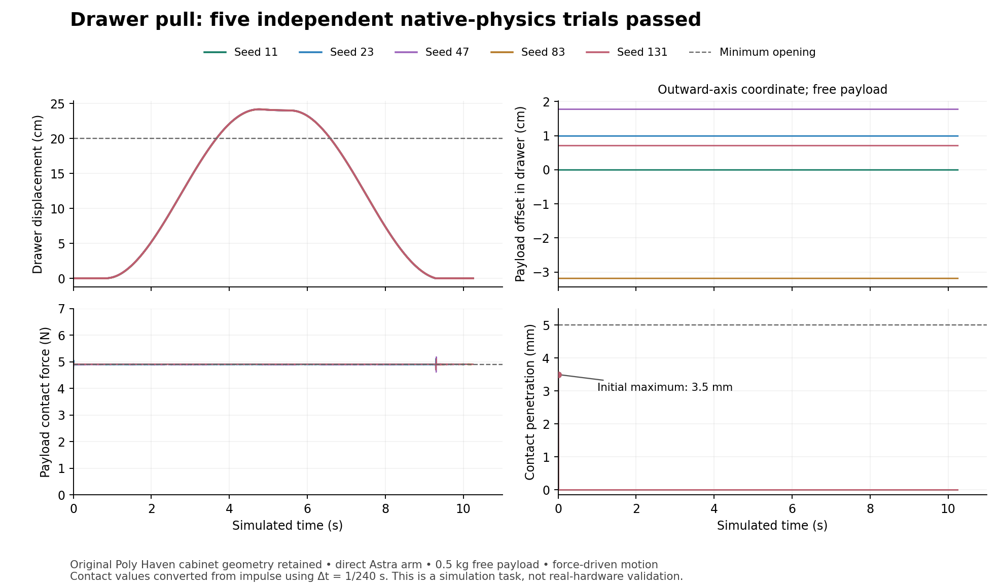

# Ten-asset Astra / Content Agents pilot

**No causal workflow advantage is established.** The recorded harness and deployment failures prevent a clean matched comparison.

**Author runs completed: 20/20.** Results below include only retained, independently assessed artifacts; pending work is not a pass.

Both arms used Astra Ultra, the same original source per pair, matched host/GPU placement, shared installed low-level tools, a 40-minute wall-time cap and two declared repairs. The intervention was the public Content Agents workflow. This is a development pilot of the configured runtime. Documented repair dependencies were missing, CPU activity overlapped, and the selected assets are not a random sample. These outcomes do not isolate workflow logic from every deployment effect.

| Measure | Direct Astra | Astra + Content Agents |
|---|---:|---:|
| Independent task passes /10 | 7 | 0 |
| Completed author runs | 10 | 10 |
| Protocol-eligible matched pairs | 0 | 0 |
| Passes within protocol-eligible pairs | 0 | 0 |
| Runs with observed protocol violations | 2 | 1 |
| Concrete rejections | 1 | 10 |
| Inconclusive evaluations | 2 | 0 |
| Demonstrated false passes | 1 | 0 |
| Authoring time, all attempts (minutes) | 249.65 | 205.99 |
| Authoring minutes per independent task pass | 35.66 | Undefined |
| Allocated GPU hours during authoring | 4.16 | 3.43 |
| Observed input tokens, including cached | 150,464,229 | 130,591,165 |
| Observed cached input tokens | 146,743,936 | 126,674,944 |
| Observed output tokens | 829,726 | 542,751 |
| Runs with complete token accounting | 10 | 9 |
| Human interventions during authoring | 0 | 0 |
| Human review seconds | Unknown | Unknown |
| Authoring cost per independent task pass (USD) | Unknown | Undefined |

Unknown costs are not zero. Supply nonnegative unit rates with their source and effective date in `protocol/rates.template.json`, then rerun the aggregator. The rate calculation includes every attempt in an arm and uses distinct-session token totals. Shared setup, idle reservation and evaluation costs are separate; allocation time is not GPU-busy time. Unmeasured human review prevents a labor-savings claim.

Independent physical acceptance and experimental eligibility are separate. A source-code exposure or other protocol violation excludes that pair from the clean comparison even if its saved asset passes physics. Global scheduling compliance and incomplete setup further limit inference; this pilot does not establish a causal workflow advantage.

| Asset | Direct physical task | Author claim | Direct protocol | Content Agents physical task | Author claim | CA protocol |
|---|---|---|---|---|---|---|
| 01 Drawer cabinet | PASS | Pass | Pass | FAIL | Declined | Pass |
| 02 Circular conveyor | PASS | Pass | Invalid | FAIL | Declined | Pass |
| 03 Commercial refrigerator | PASS | Pass | Pass | FAIL | Declined | Pass |
| 04 Linkage servo gripper | PASS | Pass | Pass | FAIL | Declined | Pass |
| 05 Machine vise | PASS | Pass | Pass | FAIL | Declined | Pass |
| 06 Miniature beam steam engine | INCONCLUSIVE | Pass | Pass | FAIL | Declined | Invalid |
| 07 Thor six-axis robot arm | FAIL | Pass | Invalid | FAIL | Declined | Pass |
| 08 Mini RC excavator | PASS | Pass | Pass | FAIL | Declined | Pass |
| 09 Voron0.2r1 CoreXY printer | INCONCLUSIVE | Pass | Pass | FAIL | Declined | Pass |
| 10 Dextra robotic hand | PASS | Declined | Pass | FAIL | Declined | Pass |

A demonstrated false pass requires an explicit pass claim and a concrete independent rejection. Missing deliverables are task rejections; an inadequate evaluator alone is inconclusive. Known numerical evaluator defects must be separately adjudicated and cannot establish false passes. Frozen and corrected measurement records are preserved.

The direct robot arm exceeded the declared five-degree joint-holding tolerance in all five independent seeds. A separate nominal-controller diagnostic removed stochastic effort terms and still measured a 6.29-degree holding error; [evidence](robot_arm_false_pass_evidence.json). Its source-code exposure is a separate protocol violation. The engine is inconclusive because its remaining rejections concern a contract ambiguity and an evaluator-owned gravity witness defect; raw and corrected records remain available.

The printer evaluator reached its existing 90-minute limit before completing source checks or producing native trials. A [harness-owned closeout](../evaluation_attempts/pilot-v1/09_printer/plain_astra/bounded_closeout_20260922/timeout_assessment.json) records INCONCLUSIVE; no frozen evaluator verdict or false pass is inferred.

The excavator uses explicitly artificial effective rotational inertias, 12 times the source-solid estimates at unchanged mass and center of mass. Any passing articulation result applies to that declared abstraction. The printer uses ideal Cartesian guides and simplified contact geometry; its proposed upward bed stroke does not establish clearance or usable travel in the original hardware. These author disclosures limit what an independent bounded task pass could demonstrate.

The direct Dextra hand author declined acceptance after two additional effort-factor endpoint probes exceeded the five-degree holding tolerance (5.50 and 5.14 degrees). Passing the five independent seeds establishes that sampled task only; it does not establish robustness over the full effort-variation interval. The author claim remains Declined even if the independent result is PASS.

Zero false passes must be read with task acceptance: an arm that declines every task has made no positive acceptance claims. It has not demonstrated useful completion merely by avoiding false positives.

## Completed physical task: drawer pull

The direct-Astra drawer passed the unchanged independent source, structure and native-physics checks in all five seeds. The original cabinet and four drawer meshes remain visible. A standalone prismatic joint constrains the upper drawer; applied force opens and closes it while a free 0.5 kg payload remains supported by contact. The minimum opening during the hold was 0.239955 m; the worst closed-hold error was 0.0001859 m. All five trials retained the payload with 2280 contact samples each. Maximum contact penetration was 3.500 mm, below the 5 mm bound.

At three checked positions, the original visible drawer floor is 4.50 mm above the accepted collision proxy. The frozen payload lower face starts 8.00 mm below that visible floor and 3.50 mm below the proxy; the recorded 5 mm penetration gate measures the proxy. Thus the source checks preserve visual geometry, while physical acceptance applies to the declared collision approximation. [Read-only source/proxy diagnostic](drawer/source_proxy_clearance.json).

The Content Agents scored drawer stopped at its Geometry handoff and explicitly claimed failure. It did not complete the native workflow chain in the scored trial. Any repaired native-workflow demonstration is a separate unscored follow-up and does not alter these paired outcomes. Mass, inertia, friction and simplified collision shapes are explicit simulation assumptions, not measured furniture properties or real-robot validation.

## Evidence and reproduction

- [Method and limitations](METHOD.md).
- [Machine-readable results](results.json) and [CSV](results.csv).
- [Original-source catalog and licensing notes](sources.json); exact byte closures and downloads are in `protocol/`.
- [Geometry failure diagnosis](workflow_geometry_diagnosis.md).
- [Independent method/dependency review](independent_method_review.md).
- [Drawer measured traces and per-seed summaries](drawer/summary.json).

The public export is an explicit subset of the local retention archive. Credentials, private model reasoning, raw private tool audits and internal service addresses are excluded. Original artifact hashes identify retained evidence. Source-download/rebuild helpers support replay; the included CC0 drawer evidence is the primary self-contained physical example.
