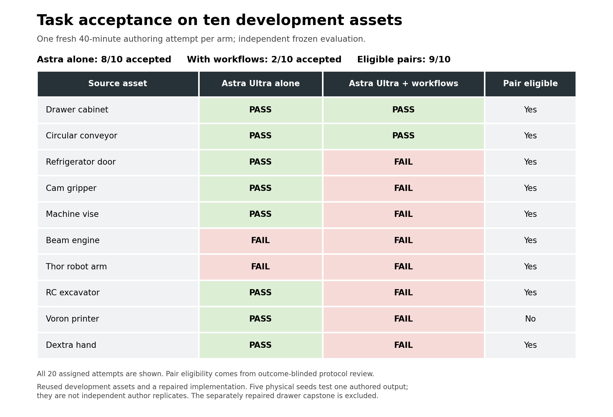

# Astra with and without Content Agents: measured development experiment

**This batch did not demonstrate a Content Agents acceptance advantage.** Across
9 protocol-eligible pairs, direct Astra accepted 7/9 assets
and the Content Agents treatment accepted 2/9. All 20 assigned
attempts and independent evaluations are complete and retained, including failures.
The full all-attempt result is 8/10 versus 2/10;
the printer pair is excluded only from the eligible paired comparison.



| Eligible paired subset | Direct Astra | Astra + Content Agents |
|---|---:|---:|
| Accepted assets | 7/9 | 2/9 |
| False passes / resolved author-positive claims | 1/8 | 0/1 |
| Author wall minutes per accepted asset | 26.41 | 163.94 |
| Allocated GPU-lane hours per accepted asset | 0.46 | 2.95 |
| API-reference USD lower bound per accepted asset | ≥$80.87 | ≥$727.68 |
| API-reference USD lower bound, all attempts in subset | ≥$566.12 | ≥$1,455.35 |
| Human review minutes per accepted asset | Unmeasured | Unmeasured |

Time and cost numerators include unsuccessful attempts in the stated subset.
The API-reference upper bounds are unknown. These are reference-rate estimates,
not an invoice; GPU and human dollar costs are unknown. The full precise values,
all-attempt summaries, request-level accounting and unchanged calculation code are
in [metrics](metrics/README.md). A false pass is an explicit author acceptance
claim followed by a concrete independent FAIL. The Content Agents conveyor passed
despite an author claim of false; its two accepted assets therefore yield only one
positive claim. This small denominator cannot establish better claim calibration.

The acceptance difference, Content Agents minus direct Astra, is
-55.6 percentage points.
There are 5 direct-only passes and 0 Content-Agents-only passes;
the preregistered exploratory exact two-sided sign-test value is
0.0625. These ten previously used public development
assets are not held-out customer data. One authoring attempt per arm and five
planned physical seeds per submitted output do not establish a population effect.

## Assets and independent outcomes

The original inputs were visual meshes or CAD assemblies lacking the complete
physics authoring and evidence required by these tasks. Complexity spans a single
slide/hinge, contact transfer and closed linkage through multi-axis mechanisms.
Source commits, acquisition hashes, license declarations and unresolved provenance
are preserved in [source notices](../astra-content-value-v2-evaluator-2026-09-23/SOURCE_NOTICES.json)
and the frozen inventories. Complexity is descriptive, not a fitted difficulty score.

| Online source | Bounded physical task | Direct Astra | Content Agents | Eligible pair |
|---|---|---|---|---|
| [Poly Haven drawer cabinet](https://polyhaven.com/a/drawer_cabinet) | Loaded drawer opening and return | [PASS](physical_evidence/runs/v2_01_drawer_plain_astra/evaluation_summary.json) | [PASS](physical_evidence/runs/v2_01_drawer_content_agents/evaluation_summary.json) | Yes |
| [Rotary conveyor](https://github.com/roshbeng/opcua_fusion_test_servers_and_hardware) | Contact-driven carrier and payload transfer | [PASS](physical_evidence/runs/v2_02_conveyor_plain_astra/evaluation_summary.json) | [PASS](physical_evidence/runs/v2_02_conveyor_content_agents/evaluation_summary.json) | Yes |
| [Commercial refrigerator](https://github.com/KhronosGroup/glTF-Sample-Assets) | Hinged door opening, return and limit load | [PASS](physical_evidence/runs/v2_03_hinge_plain_astra/evaluation_summary.json) | [FAIL](physical_evidence/runs/v2_03_hinge_content_agents/evaluation_summary.json) | Yes |
| [ST3215 linkage gripper](https://github.com/ThorstenBrach/ST3215-Servo-Gripper) | Closed linkage; grasp, hold and release a block | [PASS](physical_evidence/runs/v2_04_gripper_plain_astra/evaluation_summary.json) | [FAIL](physical_evidence/runs/v2_04_gripper_content_agents/evaluation_summary.json) | Yes |
| [Machine vise](https://github.com/Amir-souhail/Digital-CADD-Certification-Course) | Jaw travel, load holding and return | [PASS](physical_evidence/runs/v2_05_vise_plain_astra/evaluation_summary.json) | [FAIL](physical_evidence/runs/v2_05_vise_content_agents/evaluation_summary.json) | Yes |
| [Miniature beam steam engine](https://github.com/KenFilms/Miniature-Beam-Steam-Engine-CAD) | Coupled crank, piston and beam under shaft load | [FAIL](physical_evidence/runs/v2_06_engine_plain_astra/evaluation_summary.json) | [FAIL](physical_evidence/runs/v2_06_engine_content_agents/evaluation_summary.json) | Yes |
| [Thor robot arm](https://github.com/AngelLM/Thor) | Six-axis articulation and load holding | [FAIL](physical_evidence/runs/v2_07_robot_arm_plain_astra/evaluation_summary.json) | [FAIL](physical_evidence/runs/v2_07_robot_arm_content_agents/evaluation_summary.json) | Yes |
| [Mini RC excavator](https://github.com/eyhxh/3Dprint-mini-RC-excavator) | Three pivots moving, holding and returning | [PASS](physical_evidence/runs/v2_08_excavator_plain_astra/evaluation_summary.json) | [FAIL](physical_evidence/runs/v2_08_excavator_content_agents/evaluation_summary.json) | Yes |
| [Voron 0.2r1 printer](https://github.com/VoronDesign/Voron-0) | Three Cartesian axes and bed payload retention | [PASS](physical_evidence/runs/v2_09_printer_plain_astra/evaluation_summary.json) | [FAIL](physical_evidence/runs/v2_09_printer_content_agents/evaluation_summary.json) | No: UI evidence |
| [Dextra robotic hand](https://github.com/Alvipe/Dextra) | Fourteen joints across five digits | [PASS](physical_evidence/runs/v2_10_complex_plain_astra/evaluation_summary.json) | [FAIL](physical_evidence/runs/v2_10_complex_content_agents/evaluation_summary.json) | Yes |

Content Agents refrigerator, vise and engine attempts reached the common author
budget without a declared output; its gripper scene lacked required bindings.
Direct Astra also submitted no engine output. These are retained FAIL outcomes,
not successful native simulations. The direct Thor arm falsely claimed acceptance
but failed joint-5 load holding. Content Agents Thor lacked required physics
structure; its excavator exceeded the bucket load-error tolerance on seed 47
(0.0884378 rad versus 0.0872665 rad), and its Dextra hand failed finger load/return
checks. Its printer failed required joint-role and source-surface retention checks.
Read [all exact per-run and per-seed reports](physical_evidence/README.md)
for the complete unsuccessful observations and any individual inconclusive checks.

## What was held constant

Both arms used fresh Astra Ultra contexts, identical original source closures,
public task contracts, installed implementation, low-level tools, rendering and
physics versions, and the same hardware lane for each pair. Each attempt had a
2,400-second author budget, one exclusive L40 GPU, four CPU quota, 32 GiB memory,
zero swap and a 1,024-process/thread limit. Four GPU lanes ran on two Horde workers.
Odd/even case order counterbalanced which arm went first. Tokens and repair counts
were not independently capped inside the same wall budget.

The treatment was required Content Agents workflow instruction and orchestration;
the control used direct low-level tools. The implementation was installed in both
arms, and control non-use was audited. This tests the previously repaired
implementation `e640b8d6aa667745830db5e9bf87fd1b4cd763cb`, not an unmodified release.
The [preregistration](../astra-content-value-v2-2026-09-22/README.md) was published
before scored authors; its historical “results pending” text remains immutable.
The [evaluator companion](../astra-content-value-v2-evaluator-2026-09-23/README.md)
contains frozen code, task contracts and positive/negative qualification evidence.
No unsuccessful author was rerun because of its result.
The [earlier invalid pilot](https://github.com/NVIDIA-Omniverse/usd-content-agents/pull/19)
remains separately preserved and is not pooled with this rerun.

All 20 outcome-blinded protocol decisions were sealed before independent outcomes
were opened. Nineteen attempts were eligible. The plain printer attempt failed
the frozen UI-capture completeness gate, excluding its matched pair. A posthoc
diagnosis found U+0085 text splitting in the frozen parser; all admitted requests
were associated and observed contexts matched Astra Ultra. The exclusion is
preserved, not manually repaired. This is not evidence of a wrong-model call.
The [public protocol audits](protocol_audits/README.md) preserve decisions and
reasons. Reviews were automated Astra Ultra reviews, not human or external-lab
replication. Private original captures and authored scripts are withheld;
their cited digests are attestations, not supplied original bytes.

## Accounting, infrastructure and limits

The scored ledger records 5,354 completed requests and 13 requests with unknown
terminal usage; 12 of 20 runs have complete usage accounting. Parent, child and
compaction calls are counted once. Missing usage remains unknown, never zero.
Exact arithmetic replay uses CPython 3.9.6 as documented in the metrics package.
The scored human-intervention log contains no recorded intervention, but human
review minutes were not measured and no labor-saving claim is supported.

The four-GPU reservation totaled 35.62 GPU-hours
for this rerun, including preparation, idle time, authoring, evaluation and evidence
retention. The observed preparation interval alone was 19.12 GPU-hours; thirteen
unscored qualification ledgers give a separate API-reference lower bound of
$75.56 with unknown upper bound. [Exact preparation accounting](preparation_accounting.json)
preserves the observations. That preparation figure excludes orchestrator
and collaboration-agent usage, the previous pilot and capstone, and is not complete
setup cost. [Resource accounting](resource_accounting.json) separates reservation
from per-author lane allocation. Both workers were stopped after complete evidence
retention; persistent volumes were preserved.

Native task dynamics used CPU PhysX via OvPhysX 0.4.13. GPU provisioning does not
make these GPU-accelerated physics trials; OVRTX used the assigned GPUs during
authoring. The [control records](controls/README.md) preserve launch, isolation,
reaping, gateway drain, health and Linux regression evidence. One transient health
timeout recovered on the next check; no causal author-impact claim is inferred.

## Completed physical chain

The separate, extensively repaired drawer capstone connects a conditional
Geometry handoff to completed native Joint, Physics and Validation work, then
passes five of five independent loaded opening/closing trials on the same final
asset. [The chain audit](../astra-drawer-capstone-chain-audit-2026-09-23/README.md)
links stage receipts, unchanged asset hashes, physical reports and traces.
It is unscored and excluded from the comparison above.

The task uses a free 0.5 kg payload and bounded force, with an ideal prismatic
constraint and cabinet-to-upper-drawer contact excluded. Geometry's formal
SimReady check and native automatic cross-stage integrity were not evaluated.
Estimated physical properties, explicit repairs and source-clear placement limits
remain disclosed. This establishes the bounded simulated task, not an uninterrupted
autonomous pipeline, hardware readiness, real rail friction or universal SimReady.

## Inspectable publication and verification

- [Quantitative records](metrics/README.md): all 20 attempts and exact accounting/comparison code.
- [Physical evidence](physical_evidence/README.md): all attempts, native reports, failed checks and complete supplied traces.
- [Protocol audits](protocol_audits/README.md) and [controls](controls/README.md): public projections with explicit original-byte boundaries.
- [Drawer/conveyor authored assets](authored_assets/README.md): exact four submitted USD/bindings/dependency closures.
- [Drawer/conveyor source/reference inputs](replay_inputs/README.md): exact retained bytes and source notices.
- [Additional submitted assets](additional_assets/README.md): a separate downloadable companion for cases 03/04/07/08/10, preserving unsuccessful and incomplete artifacts.

Cases 05/06 geometry remains withheld under recorded source-license uncertainty;
case 09 modified-source distribution requirements remain unresolved. No complete
ten-case executable replay is claimed. Environment/runtime relocation and missing
source/reference dependencies must be independently qualified. The exact drawer
reference glTF retains three unresolved adjacent image URIs; the separate original
textured source and the plain submitted asset's required textures are supplied.
Integrity verification is distinct from replaying a model or physical solver.

From this directory, using CPython 3.9.6:

```sh
python3 -B verify_results.py . --deep
```

This checks complete supplied membership, hashes, quantitative reproduction,
physical-report consistency and agreement across all 20 audit/result records.
It also binds the four in-repository submitted assets to the independently
evaluated asset hashes. It runs no author program, model, renderer or simulator.
The top-level manifest binds all supplied files; unavailable original evidence is
never represented as publicly verified original content.
