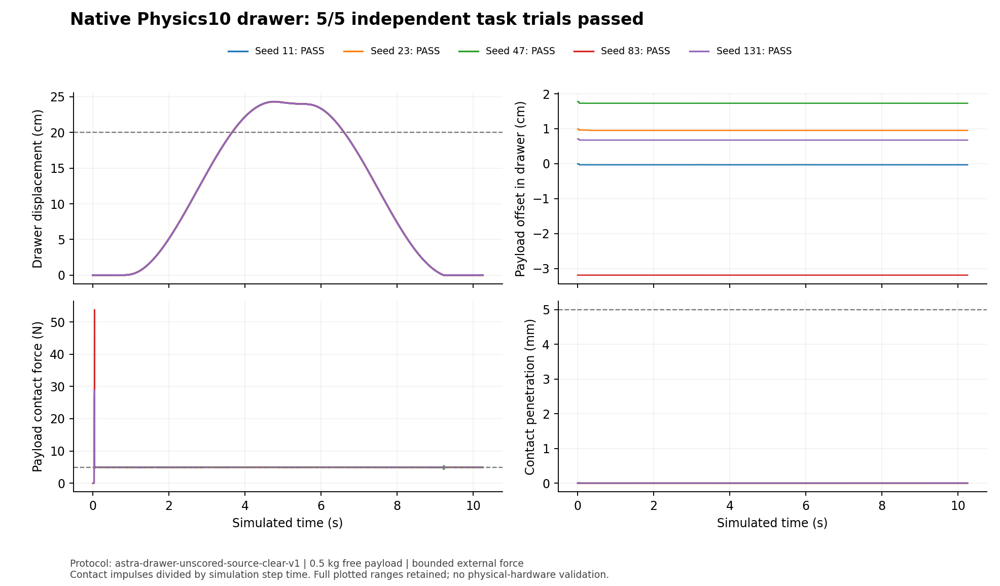

# Native drawer capstone: bounded Validation and loaded-task checks passed

This separate, unscored follow-up preserves the original CC0 drawer geometry and
all completed outcomes. **Native Validation passed and all five independent
loaded-task trials passed on the exact same authored asset.** This is a bounded
CPU rigid-body, ideal-joint result; Geometry remains conditional and standalone
cross-stage integrity was not evaluated. The frozen pilot and its results are
unchanged. [Final conjunction](evidence/final_capstone_conjunction.json),
[independent review](evidence/final_conjunction_independent_review.json),
[machine-readable outcome](outcome.json).

| Stage | Retained outcome | Evidence |
| --- | --- | --- |
| Geometry04 | Source-preserving, conditional handoff | [Native result](runs/drawer_geometry_04/geometry_workflow_result.json), [six views](runs/drawer_geometry_04/render_evidence/geometry_six_view.png) |
| Joint02 | Native articulation accepted | [Terminal receipt](runs/drawer_joint_02/standalone_articulation_terminal_receipt.json) |
| Physics03 / 06 / 07 | Failed | [03](runs/drawer_physics_03/validation_evidence.json), [06](runs/drawer_physics_06/validation_evidence.json), [07](runs/drawer_physics_07/validation_evidence.json) |
| Physics08 | Native workflow failed; visual review unresolved; independent task **0/5** | [Assessment](runs/drawer_physics_08/physics_behavior_assessment.json), [task report](evaluations/native08_source_clear_v1/report.json) |
| Physics09 | Native workflow failed; visual review unresolved; independent task **0/5** | [Assessment](runs/drawer_physics_09/physics_behavior_assessment.json), [task report](evaluations/native09_source_clear_v1/report.json) |
| Joint03 | Native articulation accepted with source-bound static Mesh endpoint | [Exact terminal receipt](runs/drawer_joint_03/standalone_articulation_terminal_receipt.json), [readback](runs/drawer_joint_03/standalone_articulation_readback.json), [canonical image](evidence/joint03_canonical_view.png) |
| Physics10 | **Native PASS** for three-second mounted-rest behavior | [Exact assessment](runs/drawer_physics_10/physics_behavior_assessment.json), [exact four-check evidence](runs/drawer_physics_10/validation_evidence.json), [runtime report](runs/drawer_physics_10/runtime/runtime_validation_report.json) |
| Physics10 independent five-seed task | **5/5 PASS**, corroborated by a separate read-only trace audit | [Exact task report](evaluations/native10_source_clear_v1/report.json), [independent audit](task_evidence_audit_v1/native10/audit.json), [same-asset bindings](evidence/native10_task_bindings.json) |
| Native Validation01 | **Terminal PASS / review accept**, four required gates pass; optional cross-stage integrity not evaluated | [Exact terminal](runs/drawer_validation_01_prepared/native_run/validation_terminal_receipt.json), [exact final assessment](runs/drawer_validation_01_prepared/native_run/canonical_validation_assessment.json), [independent review](runs/drawer_validation_01_prepared/independent_review.json) |



The [three retained stills](task_replay/native10_seed11_v2/presentation_receipt.json)
show recorded seed11 poses at [settled](task_replay/native10_seed11_v2/frames/usd_cam__1024x1024__f0179.png),
[held open](task_replay/native10_seed11_v2/frames/usd_cam__1024x1024__f1230.png), and
[held closed](task_replay/native10_seed11_v2/frames/usd_cam__1024x1024__f2459.png).
They are presentation of the measured replay, not a continuous animation or new
simulation. Native OVRTX is reported by probe/render commands; individual frame
renderer identities are null, so the images grant no additional acceptance.

Native10's pass is a narrower milestone: its [exact typed assessment](runs/drawer_physics_10/physics_behavior_assessment.json)
limits that native claim to constrained mounted rest. The [independent loaded-task report](evaluations/native10_source_clear_v1/report.json)
passes all five seeds on the same authored USD. Its [trace audit](task_evidence_audit_v1/native10/audit.json)
checks all5×2460 recorded samples and retains the missing-initial-pose and contact
attribution limits. The completed native Validation terminal separately accepts
its static, runtime, visual and package gates without waivers. The [fresh native
render](runs/drawer_validation_01_prepared/native_run/operations/render_valid/renders/000_physics_c491b4e7/000_physics_c491b4e7_plus_xplus_yplus_z_0000.png)
is visual evidence, not a substitute for the measured task.
[10 export verification](task_plots/native10_source_clear_v1/export_verification.json)
binds all complete compressed traces to the original uncompressed hashes.

The [09 report](evaluations/native09_source_clear_v1/report.json) and
[08 report](evaluations/native08_source_clear_v1/report.json) bind each unchanged
asset and frozen task. [A separately qualified trace auditor](task_evidence_audit_v1/qualification.json)
corroborates09's failures without re-simulation. Each plot folder includes five CSVs and five **complete,
lossless** gzip traces. [09 export verification](task_plots/native09_source_clear_v1/export_verification.json)
binds compressed and original uncompressed hashes. Smoke stability, a render, or
accepted articulation does not establish loaded opening or payload retention.
The [final receipt](evidence/final_capstone_conjunction.json) verifies native
Validation **and** five independent task passes on exactly the same authored USD
SHA256. It does not confer universal SimReady, hardware realism or a causal
workflow cost or effectiveness claim.

Joint03 changes the cabinet joint target to the actual static Mesh and preserves
the upper drawer owner. The later [topology promotion](runs/drawer_topology_03/physics_topology_plan.json)
adds a rigid-body owner only to the upper drawer; it does not author masses or
colliders. The declared ideal-joint contract excludes cabinet-to-upper-drawer
contacts; independent payload contact and retention are still required. [Preparation](runs/articulation_preparation_03/articulation_preparation_publication.json),
[packaging04](runs/drawer_packaging_04/packaging_fidelity.json), and
[packaging05](runs/drawer_packaging_05/packaging_fidelity.json) preserve the source
chain. Independent CPU readback verifies all five original point/index arrays,
world transforms, units and axis for [Joint03](publication_review/original_arrays_joint03.json)
and [package05](publication_review/original_arrays_joint03_package05.json).
These are completed preparation/articulation stages, not physical acceptance.

The [original source](source/drawer_cabinet_1k.gltf), BIN and three textures are
exact CC0 source bytes. [License provenance](source/license_provenance.json).
[Source-clear fixture](SOURCE_CLEAR_FIXTURE.md) explains the predeclared source-only
payload placement correction and source/proxy-floor limitation.

From this bundle directory, checksum/privacy/link checks and synthetic negative
controls need Python; image checks need Pillow. No model, renderer or solver runs:

```sh
python tools/verify_public_bundle.py .
python -m unittest discover -s tools -p test_publication_tools.py
python tools/rebuild_source_clear_fixture.py . ../fresh-source-clear-fixture
```

With compatible OpenUSD installed, decode layers and create separately labeled
portable copies; original USD bytes remain unchanged:

```sh
python tools/verify_public_bundle.py . --decode-usd
python tools/relocate_usd_paths.py . ../portable-native
python tools/verify_source_arrays.py --help
```

[Evidence notes](EVIDENCE_NOTES.md) retain the full historical results, exact versus
projected hash semantics, intermediate receipt limits, original fixture
reconstruction, cooking warnings, portability qualifications and an explicit
command for a **new** native task execution. [Publication manifest](publication_manifest.json)
identifies every selected file. Exact receipts are retained when safe; projections
are labeled and are not interchangeable with original native Validation inputs.
[Code patch](code/capstone_changes.patch) is separate from authored outputs.
